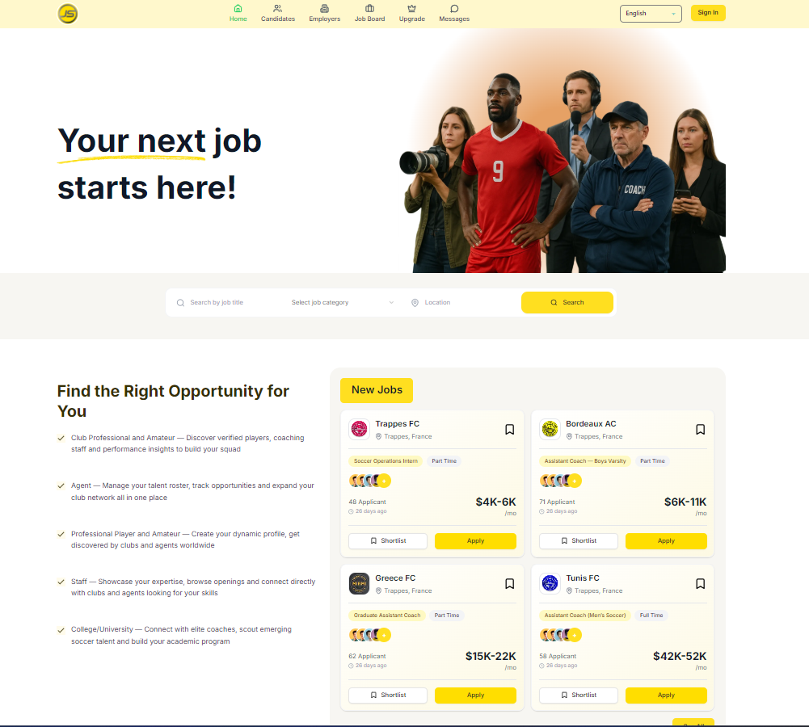
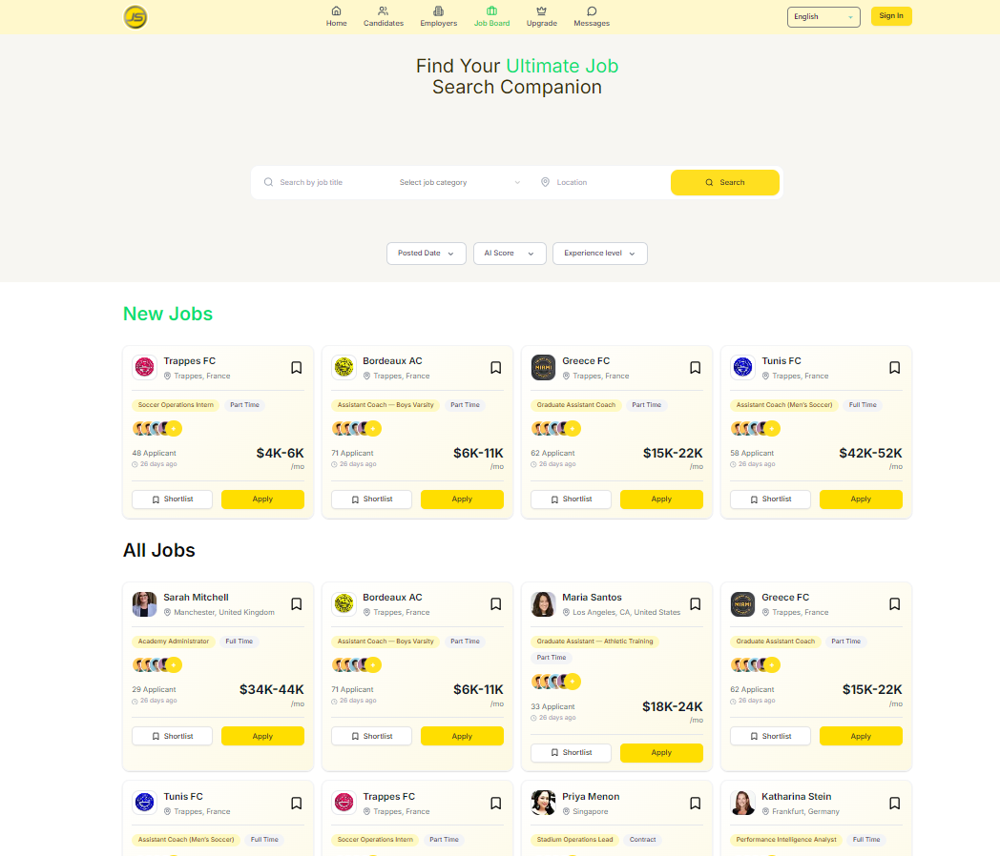
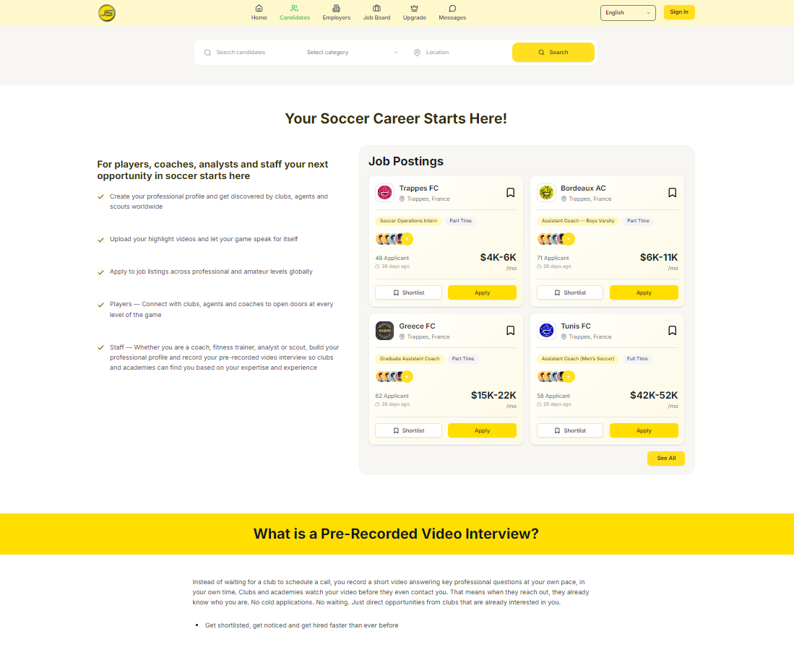
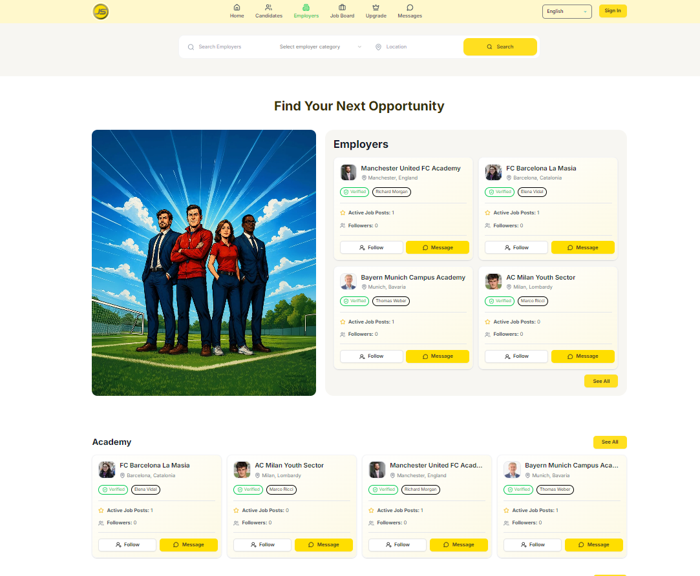

<div align="center">

# Job Soccer ⚽️💼

> ⚡ Production-ready job + networking platform frontend built with Next.js

**Job Soccer** is a modern **Next.js App Router** web application for a job marketplace + professional network experience—supporting authentication, profiles (candidate/employer), job discovery & hiring flows, real-time messaging, notifications, and LinkedIn OAuth.


</div>

---

## 📚 Table of Contents

- [🌐 Live Demo](#live-demo)
- [📖 Project Overview](#project-overview)
- [🧰 Tech Stack](#tech-stack)
- [✨ Key Features](#key-features)
- [📸 Screenshots](#screenshots)
- [🗂️ Project Structure](#project-structure)
- [🛠️ Installation](#installation)
- [🔐 Environment Variables](#environment-variables)
- [📦 Scripts](#scripts)
- [🚀 Build & Deployment](#build-deployment)
- [🔐 Security Notes](#security-notes)

---

<a id="live-demo"></a>

## 🌐 Live Demo

🔗 http://74.208.193.37:3000

> ⚠️ Some features (authentication, chat, notifications) may require a working backend and valid credentials.

---

<a id="project-overview"></a>

## 📖 Project Overview

This repository contains the **frontend** of **Job Soccer**, built using **Next.js App Router** and a scalable component + Redux architecture.

It includes:

- Auth flows (signup/signin, forgot password, email verification)
- Candidate & employer profiles
- Jobs module (browse, post/manage, hiring-related screens)
- Messaging + notifications with Socket.IO
- Social/networking screens (my network, requests)
- LinkedIn OAuth login/signup

---

<a id="tech-stack"></a>

## 🧰 Tech Stack

### Core

- **Next.js 15** (App Router)
- **React 19**
- **TypeScript 5**

### UI & Styling

- **Tailwind CSS 4**
- **shadcn/ui** (project configured via `components.json`)
- **Radix UI**
- **lucide-react** (icons)
- **react-icons**
- **tw-animate-css**
- **class-variance-authority**, **clsx**, **tailwind-merge**

### State, Data & Forms

- **Redux Toolkit** + **RTK Query**
- **react-redux**
- **redux-persist**
- **react-hook-form**
- **@hookform/resolvers**
- **zod**

### Realtime & UX Utilities

- **socket.io-client** (real-time chat + notifications)
- **sonner** (toast notifications)
- **date-fns** (date formatting)

### Tooling

- **ESLint 9** + `eslint-config-next`

---

<a id="key-features"></a>

## ✨ Key Features

- 🔐 **Authentication**: signup/signin, email verification, password reset flows
- 🧑‍💼 **Profiles**: candidate + employer profile experiences
- 💼 **Jobs**: browse jobs, job cards, employer job management
- 🤝 **Networking**: my network, friend requests, candidate/employer public pages
- 💬 **Real-time Messaging**: chat UI backed by Socket.IO
- 🔔 **Real-time Notifications**: live unread count + notifications stream
- ⭐ **Agent Rating System**: candidates can rate employer “agents” (1–5 stars)
- 🔗 **LinkedIn OAuth**: login/signup with LinkedIn (with callback handler)

---

<a id="screenshots"></a>

## 📸 Screenshots

<div align="center">
	<p>Explore the Job Soccer user interface across core modules.</p>

|                         🏠 Home                          |                         💼 Job Board                          |
| :------------------------------------------------------: | :-----------------------------------------------------------: |
|  |  |

<br />

|                         🧑‍💻 Candidates                          |                         🏢 Employers                          |
| :------------------------------------------------------------: | :-----------------------------------------------------------: |
|  |  |

</div>

<a id="project-structure"></a>

## 🗂️ Project Structure

```bash
src/
	app/
		(auth)/
			signin/ signup/ forgot-password/
			email-verification/ create-new-password/
			create-profile/
		(main)/
			page.tsx
			candidates/ employers/ jobs/
			messages/ my-network/ notification/
			profile/ upgrade/
		api/
			linkedin/
	assets/
	components/
		auth/ cards/ form/ forms/ messaging/ modals/
		profile/ providers/ shared/ sidebars/ ui/
	redux/
		api/ features/ store.ts
	hooks/
	lib/
	types/
```

---

<a id="installation"></a>

## 🛠️ Installation

### 1) Prerequisites

- **Node.js** (18+ recommended)
- **npm** (comes with Node)

### 2) Install dependencies

```bash
npm install
```

### 3) Configure environment variables

Create `.env.local` in the project root (see the next section).

### 4) Run the development server

```bash
npm run dev
```

Open: http://localhost:3000

---

<a id="environment-variables"></a>

## 🔐 Environment Variables

You can start from the included example file: [.env.example](.env.example).

### Option A (recommended): copy the template

```bash
# Windows PowerShell
Copy-Item .env.example .env.local
```

```bash
# macOS / Linux
cp .env.example .env.local
```

### Required (Backend + Realtime)

```env
# Backend API base URL
NEXT_PUBLIC_BASE_URL=http://localhost:5000

# Socket.IO server URL (real-time messaging/notifications)
NEXT_PUBLIC_SOCKET_URL=http://localhost:5000

# Optional: image/file host URL (if different from NEXT_PUBLIC_BASE_URL)
NEXT_PUBLIC_IMAGE_URL=http://localhost:5000

# Used by next.config.ts for next/image remotePatterns
NEXT_PUBLIC_HOSTNAME=localhost
```

---

<a id="scripts"></a>

## 📦 Scripts

```bash
npm run dev     # Start dev server
npm run build   # Build for production
npm run start   # Start production server
npm run lint    # Lint the codebase
```

---

<a id="build-deployment"></a>

## 🚀 Build & Deployment

```bash
npm run build
npm run start
```

Make sure your deployment platform has the same environment variables configured (especially `NEXT_PUBLIC_BASE_URL` and `NEXT_PUBLIC_SOCKET_URL`).

---

<a id="security-notes"></a>

## 🔐 Security Notes

- ⚠️ **Do not commit real secrets** to git. Use `.env.local` (and keep it out of version control).
- ⚠️ The current LinkedIn configuration uses `NEXT_PUBLIC_PRIMARY_CLIENT_SECRET`. In production, consider moving token exchange/secret usage entirely to server-only env vars.

---

## 🙌 Final Note

This project demonstrates a scalable Next.js App Router frontend with real-time features, Redux Toolkit state management, and a modern UI stack (Tailwind + shadcn/ui).
